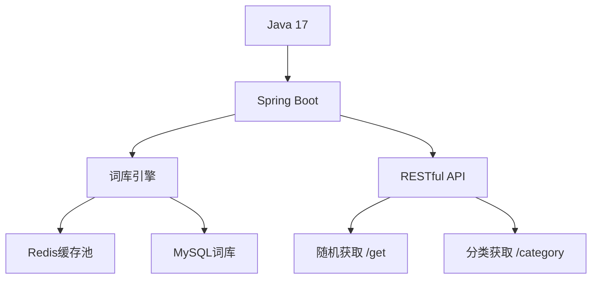

# 多多一言
#

#### Description
BallonWords is a lightweight Chinese sentence inspiration platform, dedicated to endowing words with vitality through technology. We use dynamic balloon special effects to carry every touching sentence, allowing fragmented inspirations such as classic lines, internet catchphrases, and literary excerpts to float into the digital world in a fun way, thus building an ever - growing open - ended sentence library.

This is a balloon art exhibition woven with JVM. The HashSet serves as the balloon - tying rope, and the LinkedList forms the floating trajectory. Through the dynamic object pool technology, each sentence becomes a suspendable BalloonEntity, gracefully swaying in the airflow of the Spring application context.

We aim to make every byte bloom into a balloon filled with philosophical thoughts, hovering lightly in the quantum gap between reality and imagination.

#### Software Architecture

#### Installation

Don't download.Just clone it directly.

#### Instructions

1.  Vocabulary balloon cycle rotation  
-Balloon inflation effect (gradual fade)  
-Classic Statement: Floating effect, stays on the screen  
-Old statement: Regularly automatically drift out of the field of vision  

2. Real-time synchronization balloon effect  
-Using HashMap to tag and group balloons (e.g., Inspirational Red, Philosophical Blue, Poetry Green)  
-Utilize PriorityQueue to display the priority of recent popular statements  
-Outdated statements execute SoftReference flexible garbage collection  

#### Contribution

1.  Fork the repository
2.  Create Feat_xxx branch
3.  Commit your code
4.  Create Pull Request

#### Gitee Feature

1.  You can use Readme\_XXX.md to support different languages, such as Readme\_en.md, Readme\_zh.md
2.  Gitee blog [blog.gitee.com](https://blog.gitee.com)
3.  Explore open source project [https://gitee.com/explore](https://gitee.com/explore)
4.  The most valuable open source project [GVP](https://gitee.com/gvp)
5.  The manual of Gitee [https://gitee.com/help](https://gitee.com/help)
6.  The most popular members  [https://gitee.com/gitee-stars/](https://gitee.com/gitee-stars/)
