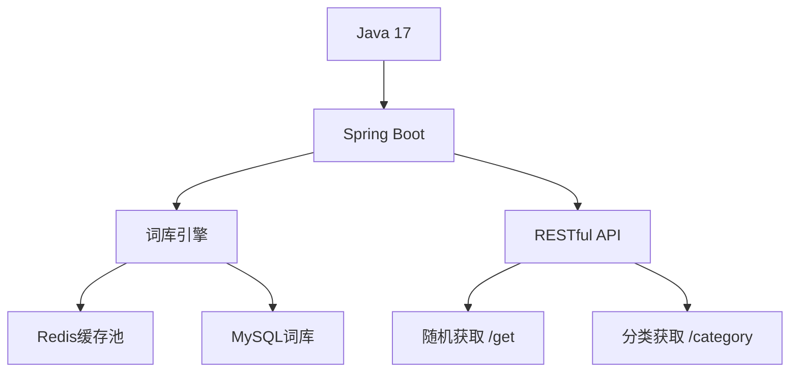

# BallonWords 🎈   **——让文字灵感如气球般在云端自在漂浮**

## 🎪 项目介绍
BallonWords是一个轻量化中文语句灵感平台，致力于用技术赋予文字生命力。我们通过动态气球特效承载每一句打动人心的文字，让经典台词、网络金句、文学摘录等碎片化灵感以充满趣味性的方式飘进数字世界，构建一个持续生长的开放式语句库。

这里是用JVM编织的气球艺术展，HashSet是气球捆扎绳，LinkedList构成飘动轨迹。我们通过动态对象池技术让每则语句都成为可悬浮的BalloonEntity，在Spring应用上下文的气流中优雅律动。

我们旨在让每个字节都绽放成载满哲思的气球，轻盈悬停于现实与想象的量子间隙。

## 🌌 项目灵感  


<div align="center">
  
  <p>✨ 每个词句都是幸运兔手中的气球 ✨</p>
</div>

## ✨ 项目特色  
**Ballon 核心设计理念**  
1. **词库气球化**  
   - 采用Java集合框架构建动态词库，每个词句如同独立气球  
   - 支持多维度分类标签（励志/哲理/诗词）  
   - 自动词频统计与热词升空特效
     
2. **色彩情绪引擎**  
   - 根据语句情感分析自动匹配气球色系  
   - 暖色系（励志红/温馨橙）  
   - 冷色系（哲理蓝/诗词青）

## 🛠️ 技术架构  


## 🛠️ 主要业务数据库表关系


## 🌈 创新亮点  
1. **词库气球生命周期**  
   - 新语句：气球充气效果(渐显)  
   - 经典语句：悬浮停留特效  
   - 旧语句：定期飘出视野范围  

2. **优秀奇数同步特效**  
   - HashMap实现标签化气球编组（励志红/哲理蓝/诗词青）
   - PriorityQueue自动排列近期热门语句高度
   - 过时语句执行SoftReference柔性回收

## 🚀 快速开始  
```bash
# 获取随机语句
curl https://api.ballonwords.com/get

# 示例响应
{
  "content": "理想如晨星，我们永不能触到",
  "color": "#FFB3CC",
  "animation": "slow_float",
  "category": "philosophy"
}
```

## 📦 词库管理  
- 支持JSON/YAML格式批量导入  
- 智能去重校验（MD5+语义双校验）  
- 词库热更新（无需重启服务）

调整重点：  
1. 所有技术描述围绕"Ballon"隐喻展开  
2. 突出Java集合框架在词库管理的核心作用  
3. 弱化复杂架构强调直观的气球交互逻辑

## 🧑💻 核心开发者
**点击图片跳转**

<a href="https://github.com/Dddddduo">
  
</a>

## 🤝 贡献者
感谢这些优秀的贡献者（按贡献时间排序）


## 📜 协作规范 

1. **代码提交**：请遵循[Angular提交规范](https://github.com/angular/angular/blob/main/CONTRIBUTING.md) 
2. **分支管理**：
    ```bash 
   git checkout -b feat/your-feature  # 新功能开发 
   git checkout -b fix/issue-number   # Bug修复

**注意**
- 新增功能请创建feature/功能名称分支
- 问题修复使用bugfix/问题描述分支
- 提交代码需通过ESLint检查 [1]
- 重大变更需更新CHANGELOG.md 文件

🕊️ 让每个灵感都能自由飞翔 —— BallonWords 开发组 🎈
