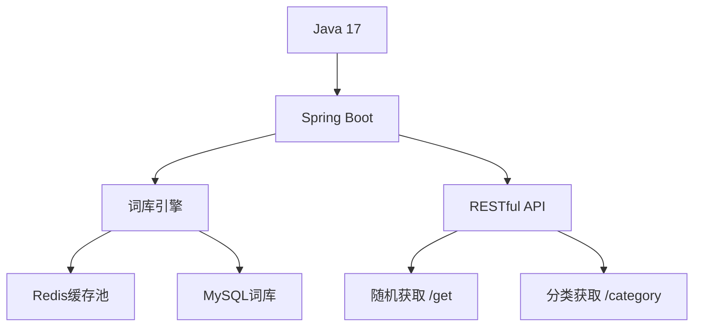

# BallonWords 🎈  
**——让文字灵感如气球般自由漂浮，飞向无限的云端**

## 🎪 项目介绍  
BallonWords 是一个轻量级中文语句灵感平台，致力于为文字注入生命力。通过动态气球特效，我们将每一句打动人心的文字承载在气球上，让经典台词、网络金句、文学摘录等灵感以趣味化的方式漂浮于数字世界，逐步构建一个持续扩展的开放式语句库。

这个项目如同用JVM编织的气球艺术展，Java集合框架在其中构成了气球捆绑绳，而LinkedList则定义了它们的飘动轨迹。借助动态对象池技术，我们让每个语句都成为一个可悬浮的 **BalloonEntity**，在Spring应用上下文的气流中优雅律动。

我们的愿景是让每个字节都绽放成充满哲理的气球，轻盈地悬浮在现实与想象的交汇点。

## 🌌 项目灵感  

<div align="center">
  
  <p>✨ 每个词句都是幸运兔手中的气球 ✨</p>
</div>

## ✨ 项目特色  
**Ballon 核心设计理念**  
1. **精选词库气球化**  
   - 利用Java集合框架构建动态词库，每个词句如同独立气球  
   - 支持多维度分类标签（励志、哲理、诗词等）  
   - 自动统计词频并为热词添加升空特效
     
2. **智能分析色彩情绪引擎**  
   - 通过语句情感分析，自动匹配气球色系  
   - 暖色系（励志红、温馨橙）  
   - 冷色系（哲理蓝、诗词青）

## ✅ 已实现功能和后期展望
  - [x] 词库管理数据库表的设计
  - [x] 初始化get接口的实现
  - [x] 根据标签去查询语句
  - [ ] 引入redis缓存降低数据库查询的压力
  - [ ] 引入消息队列解耦
  - [ ] 前端接口文档的开发

## 🌱 开发日志

**2.10 - 2.12**
- 设计数据库表
- 多表联查实现第一个接口 /get

**2.22 - 2.24**
- 完成基础的五个接口
- 使用Junit5+MockMvc集成单元测试

## 🛠️ 技术架构  



## 🛠️ 主要数据库表关系  


## 🌈 创新亮点  
1. **词库气球周期轮换**  
   - 新语句：气球充气效果（渐显）  
   - 经典语句：悬浮特效，停留在屏幕上  
   - 旧语句：定期自动飘出视野范围  

2. **实时同步气球特效**  
   - 使用HashMap对气球进行标签化分组（如：励志红、哲理蓝、诗词青）  
   - 利用PriorityQueue排列近期热门语句的显示优先级  
   - 过时语句执行SoftReference柔性回收

## 🚀 快速开始  


```bash
# 获取随机语句
curl https://api.ballonwords.com/get

# 示例响应
{
   "content": "你好像在等十九世纪的青洄，可我是北纬六十七度以北的雪",
    "tagName": [
      "青春",
      "故事"
    ]
}
```

## 📦 词库管理  
- 支持JSON/YAML格式批量导入  
- 自动去重校验（基于MD5和语义校验）  
- 词库支持热更新，无需重启服务

### 调整重点：
1. 技术描述围绕“Ballon”隐喻展开，简化了部分技术内容。
2. 突出Java集合框架在词库管理中的关键作用。
3. 直观展示了气球交互的逻辑，降低了架构的复杂度。

## 🧑💻 核心开发者  
**点击图片跳转至个人主页**

<a href="https://github.com/Dddddduo">
  
</a>

## 🤝 贡献者  
感谢以下贡献者（按贡献时间排序）  

<a href="https://github.com/yapi0420" style="display: block; text-align: center; margin-top: 10px;">
  
</a>
<a href="https://github.com/666mch" style="display: block; text-align: center; margin-bottom: 10px;">
  
</a>

## 📜 协作规范
1. **代码仓库地址**：https://github.com/Dddddduo/balloonWords
2. **代码提交**：请遵循[Angular提交规范](https://github.com/angular/angular/blob/main/CONTRIBUTING.md)  
3. **分支管理**：
    ```bash 
   git checkout -b feat/your-feature  # 新功能开发 
   git checkout -b fix/issue-number   # Bug修复
    ```

**注意事项**：
- 新功能开发请使用`feature/功能名称`分支。
- 问题修复使用`bugfix/问题描述`分支。
- 提交代码需通过ESLint检查 [1]。
- 重大变更需更新`CHANGELOG.md`文件。

🕊️ 让每个灵感都能自由飞翔 —— BallonWords 开发组 🎈
